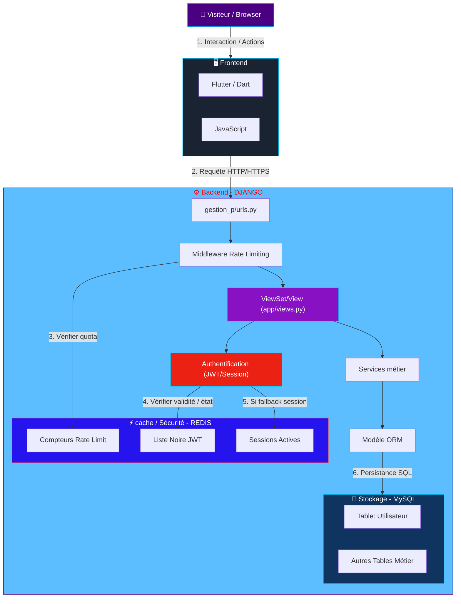
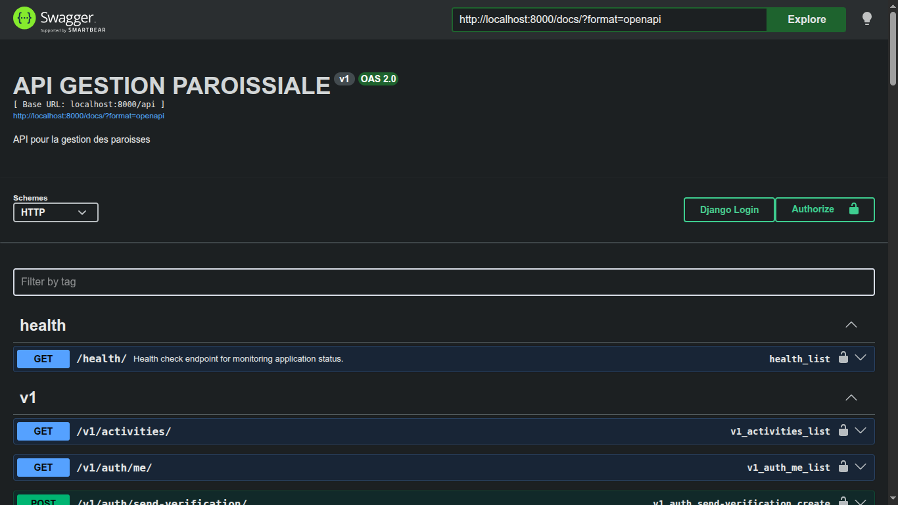
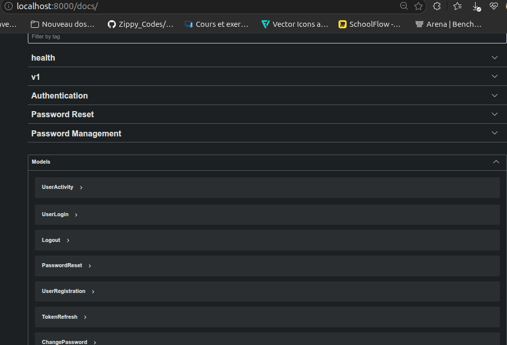
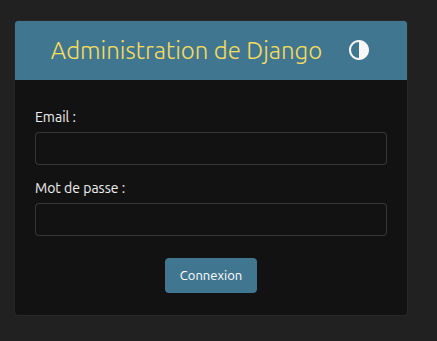
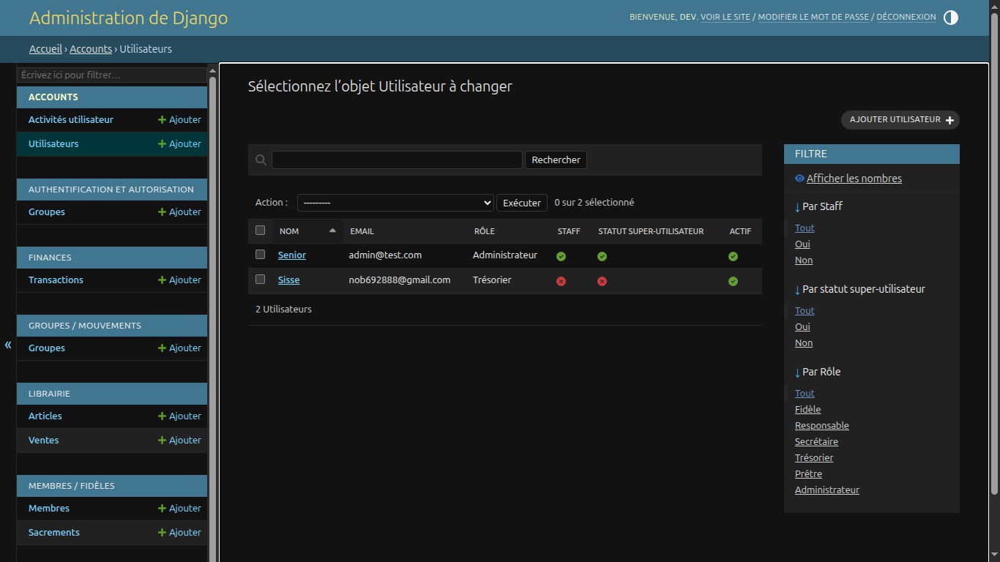

<div align="center">


# Gestion Paroissiale — API REST

API REST de **gestion paroissiale** développée avec Django et Django REST Framework.
Authentification JWT, rôles hiérarchiques, vérification d'e-mail, et gestion des
membres, groupes, événements, finances et de la librairie de la paroisse.

[](https://github.com/DESMOND-77/Gestion_paroissiale/actions/workflows/ci.yml)
[](https://github.com/DESMOND-77/Gestion_paroissiale/actions/workflows/codeql.yml)
[](https://github.com/DESMOND-77/Gestion_paroissiale/releases)
[](LICENSE)
[](https://github.com/DESMOND-77/Gestion_paroissiale/stargazers)
[](https://github.com/DESMOND-77/Gestion_paroissiale/network/members)
[](https://github.com/DESMOND-77/Gestion_paroissiale/issues)
[](https://www.python.org/)
[](https://www.djangoproject.com/)

</div>

> La langue de l'application, des commentaires et des messages d'API est le **français**.

---

## Sommaire

- [Gestion Paroissiale — API REST](#gestion-paroissiale--api-rest)
  - [Sommaire](#sommaire)
  - [Fonctionnalités](#fonctionnalités)
  - [Pile technique](#pile-technique)
  - [Architecture](#architecture)
    - [Flux d'une requête](#flux-dune-requête)
    - [Responsabilités des couches](#responsabilités-des-couches)
    - [Modules applicatifs](#modules-applicatifs)
  - [Prérequis](#prérequis)
  - [Installation](#installation)
  - [Configuration (.env)](#configuration-env)
  - [Lancer le projet](#lancer-le-projet)
    - [Développement](#développement)
    - [Production](#production)
  - [Commandes utiles](#commandes-utiles)
  - [Rôles et permissions](#rôles-et-permissions)
  - [Authentification JWT](#authentification-jwt)
  - [Endpoints de l'API](#endpoints-de-lapi)
    - [Authentification \& comptes (`/api/v1/`)](#authentification--comptes-apiv1)
    - [Modules métier](#modules-métier)
  - [Format des réponses](#format-des-réponses)
  - [Exemples d'utilisation](#exemples-dutilisation)
  - [Captures d'écran](#captures-décran)
  - [Structure du projet](#structure-du-projet)
  - [Documentation](#documentation)
  - [Feuille de route](#feuille-de-route)
  - [FAQ](#faq)
  - [Contribuer](#contribuer)
  - [Sécurité](#sécurité)
  - [Licence](#licence)
  - [Auteurs](#auteurs)
  - [Remerciements](#remerciements)

---

## Fonctionnalités

- 🔐 **Authentification JWT** complète (inscription, connexion, déconnexion, rafraîchissement, validation de jeton) avec suivi des jetons dans Redis par `jti` et liste noire côté serveur.
- 📧 **Vérification d'e-mail obligatoire** et **réinitialisation de mot de passe** par e-mail (pages HTML conviviales servies par l'API).
- 👥 **Rôles hiérarchiques** (fidèle < responsable < secrétaire < trésorier < prêtre < admin) + **permissions métier granulaires** (RBAC, `core/rbac.py`).
- 🛡️ **Sécurité** : verrouillage de compte après 5 tentatives échouées (15 min), limitation de débit (throttling DRF), en-têtes de sécurité HTTP, HSTS en production.
- 🔄 **Synchronisation hors ligne** : clés primaires UUID générées côté client, endpoint batch bidirectionnel `POST /api/v1/sync/` (upsert *last-write-wins*, suppression logique).
- 🧾 **Journal des activités** utilisateur (consultable par un admin).
- ⛪ Modules métier : **membres** (fiches paroissiales + sacrements), **groupes**, **événements** (+ participations), **finances** (transactions, dons, rapports), **librairie** (articles, ventes, alertes de stock).
- 📚 **Documentation API** auto-générée (Swagger / ReDoc) et **health check** infra (`/api/health/`).

---

## Pile technique

| Composant | Technologie |
| --- | --- |
| Langage | Python 3.14 |
| Framework | Django 6.0 |
| API | Django REST Framework 3.17 (versionnage d'URL `v1`) |
| Authentification | `djangorestframework-simplejwt` + `TokenManager` (suivi Redis) |
| Base de données | MySQL/MariaDB (`mysqlclient`) — PostgreSQL via `DATABASE_URL` (`dj-database-url` / `psycopg2`) |
| Cache / jetons / sessions | Redis 7 (`django-redis`) |
| E-mail | Resend via `django-anymail`, repli SMTP en développement |
| Documentation | drf-yasg (Swagger / ReDoc) |
| Fichiers statiques | WhiteNoise |
| Serveur WSGI | Gunicorn |
| Qualité de code | ruff (lint + format, config dans `pyproject.toml`) |
| Conteneurisation | Docker (multi-stage) + docker-compose (MariaDB, Redis, web) |
| Déploiement | Render (Blueprint `render.yaml`) |

---

## Architecture

Description détaillée : [`docs/architecture.md`](docs/architecture.md).

### Flux d'une requête



### Responsabilités des couches

- **Views** (`app/views.py`) — gestion HTTP via les vues/ViewSets DRF, validation, réponses standardisées. La plupart héritent de `core/base_view.py::BaseAPIView`.
- **Services** — logique métier complexe : sous-packages de `accounts` (`auth/`, `profile/`, `verification/`) et `services.py` dans les autres apps (ex. `membres/services.py`).
- **Serializers** (`app/serializers.py`) — validation et transformation des données.
- **Models** (`app/models.py`) — modèles UUID (héritent de `core.models.SyncableModel` pour la synchro hors ligne) et managers personnalisés.
- **`core/`** (racine) — utilitaires transverses : `jwt_utils.py` (TokenManager), `response.py`, `exception_handler.py`, `base_view.py`, `rbac.py` (catalogue des permissions), `permissions.py`, `health.py`, `sync.py`.

### Modules applicatifs

| App | Rôle |
| --- | --- |
| `accounts` | Authentification, profil, vérification e-mail, cycle de vie des jetons JWT |
| `membres` | Fiches des paroissiens (avec ou sans compte) et sacrements |
| `groupes` | Gestion des groupes / associations |
| `evenements` | Planification des événements + participations |
| `finances` | Transactions, dons, rapports financiers |
| `librairie` | Articles, ventes, alertes de stock |
| `core` | Utilitaires partagés (réponses, permissions, RBAC, sync, santé) |

> **`User` vs `Membre`** : `accounts.User` est l'identité de connexion ; `membres.Membre`
> est la fiche pastorale (liée par un `OneToOneField` *nullable* — une paroisse suit
> aussi des personnes sans compte). Un signal crée automatiquement le `Membre` à la
> création d'un `User` et synchronise `nom`/`prenom` dans les deux sens.

---

## Prérequis

- **Python 3.14+**
- **MySQL/MariaDB** (ou PostgreSQL via `DATABASE_URL`)
- **Redis 7** (local ou via Docker) — facultatif en développement (repli `LocMemCache`)
- **Docker + Docker Compose** (optionnel, pour l'environnement complet)
- Un compte **Resend** (envoi d'e-mails) ou des identifiants SMTP en développement

---

## Installation

```bash
# 1. Cloner le dépôt
git clone https://github.com/DESMOND-77/Gestion_paroissiale.git
cd Gestion_paroissiale

# 2. Créer et activer l'environnement virtuel
python -m venv .venv
source .venv/bin/activate

# 3. Installer les dépendances
pip install -r requirements.txt

# 4. Créer le fichier .env
cp .env.example .env   # puis renseigner les valeurs

# 5. Démarrer MariaDB + Redis (via Docker)
docker-compose up -d db redis

# 6. Appliquer les migrations
python manage.py migrate

# 7. Créer un super-utilisateur
python manage.py createsuperuser
```

Guide détaillé : [`docs/installation.md`](docs/installation.md).

---

## Configuration (.env)

Copier [`.env.example`](.env.example) vers `.env` et renseigner les valeurs.
Principales variables :

| Variable | Rôle | Exemple |
| --- | --- | --- |
| `SECRET_KEY` | Clé secrète Django (obligatoire) | chaîne aléatoire longue |
| `DEBUG` | Mode debug (jamais `True` en production) | `True` |
| `DJANGO_ALLOWED_HOSTS` | Hôtes autorisés (séparés par des virgules) | `127.0.0.1,localhost` |
| `DATABASE_URL` | URL BDD (prioritaire sur `DB_*`) | `postgres://…` / `sqlite:///db.sqlite3` |
| `DB_NAME` / `DB_USER` / `DB_PASSWORD` / `DB_HOST` / `DB_PORT` | Connexion MySQL locale | `gestion_paroissiale_db` / `root` / … |
| `REDIS_URL` | Redis (jetons, cache, verrouillage) | `redis://127.0.0.1:6379/0` |
| `EMAIL_BACKEND` | Backend d'e-mail principal | `anymail.backends.resend.EmailBackend` |
| `EMAIL_FALLBACK_BACKEND` | Backend de repli (vide pour désactiver) | backend SMTP Django |
| `RESEND_API_KEY` | Clé API Resend | `re_…` |
| `FROM_EMAIL` | Adresse expéditrice | `Paroisse <no-reply@…>` |
| `EMAIL_HOST*` | Identifiants SMTP (repli / dev) | `smtp.gmail.com`, port `587`… |
| `PUBLIC_BASE_URL` | Base des liens dans les e-mails | `https://exemple.com/api` |
| `FRONTEND_URL` | URL du frontend (CORS, redirections) | `http://localhost:3000` |

> **Important** : en production (Render), l'envoi d'e-mails passe par **Resend**
> (via `django-anymail`) — le SMTP sortant y est bloqué. Ne pas revenir au backend
> SMTP en production.

---

## Lancer le projet

### Développement

```bash
# Serveur de développement
python manage.py runserver 0.0.0.0:8000

# Vérifier la connectivité Redis
python test_redis.py
```

L'API est alors accessible sur `http://127.0.0.1:8000/`.

Environnement complet avec Docker (MariaDB + Redis + Django) :

```bash
docker-compose up
# API : http://127.0.0.1:8100/  —  MariaDB : port 3307  —  Redis : port 6380
```

### Production

Le déploiement de référence est **Render** via le Blueprint [`render.yaml`](render.yaml)
(build Docker, migrations et `collectstatic` au démarrage via `entrypoint.sh`,
Gunicorn, health check sur `/api/health/`).

```bash
# Image de production (multi-stage, utilisateur non-root)
docker build -t gestion-paroissiale .
docker run --env-file .env -p 8000:8000 gestion-paroissiale
```

Guide complet : [`docs/deployment.md`](docs/deployment.md).

---

## Commandes utiles

```bash
python manage.py migrate                  # Appliquer les migrations
python manage.py makemigrations           # Générer les migrations
python manage.py createsuperuser          # Créer un administrateur
python manage.py check                    # Vérifications Django

pip install --group dev                   # Outils de dev (ruff)
ruff check .                              # Lint
ruff format .                             # Formatage
python manage.py collectstatic --noinput  # Collecter les fichiers statiques

python manage.py test                     # Tous les tests
python manage.py test accounts            # Tests d'une app
python manage.py test accounts.tests.test_login  # Un module de test

python test_logging.py                    # Test de la journalisation
python test_redis.py                      # Test de connectivité Redis

docker-compose up -d                      # MariaDB + Redis + API
docker-compose logs -f web                # Logs du conteneur API
```

---

## Rôles et permissions

Le modèle utilisateur personnalisé (`accounts.models.User`) étend `AbstractBaseUser`
(`USERNAME_FIELD` = **e-mail**). Deux mécanismes coexistent :

1. **Hiérarchie de rôles** — classes DRF `IsAdmin`, `IsSecretaryOrAbove`,
   `IsTreasurerOrAbove` (`core/permissions.py`).
2. **Permissions métier granulaires (RBAC)** — identifiants texte
   (`manage_membres`, `view_finances`, …) catalogués dans `core/rbac.py` et mappés
   par rôle dans `ROLE_PERMISSIONS`. À vérifier via `user.has_permission("…")` ou
   les fabriques `HasPermission(...)` / `HasAnyPermission(...)` / `HasAllPermissions(...)`.

| Rôle | Permissions métier |
| --- | --- |
| **admin** (Administrateur) | Accès complet : utilisateurs, finances, événements, groupes, membres, activités, librairie |
| **pretre** (Prêtre) | Finances, événements, groupes, membres, librairie |
| **tresorier** (Trésorier) | Finances, membres, consultation des activités |
| **secretaire** (Secrétaire) | Événements, groupes, membres, librairie |
| **responsable** (Responsable) | Membres, groupes |
| **fidele** (Fidèle) | Lecture de son propre profil |

`POST /api/v1/auth/check-permission/` renvoie `has_permission` et la liste complète
des permissions de l'appelant.

---

## Authentification JWT

`TokenManager` (`core/jwt_utils.py`) gère le cycle de vie complet des jetons :

- **Jeton d'accès** : 15 minutes — **Jeton de rafraîchissement** : 7 jours, avec
  **rotation** (`ROTATE_REFRESH_TOKENS`).
- Les jetons sont suivis dans Redis par leur `jti` (repli `LocMemCache` sans Redis).
- La déconnexion et le changement de mot de passe mettent **tous** les jetons de
  l'utilisateur en liste noire (`blacklist_all_user_tokens()`).

Sécurité supplémentaire :

- **5 tentatives** de connexion échouées → verrouillage de **15 minutes** (suivi Redis).
- La **vérification d'e-mail est obligatoire** avant la première connexion.
- **Limitation de débit** via les classes de throttle DRF sur les endpoints sensibles.

---

## Endpoints de l'API

Toutes les routes métier sont **versionnées** sous `/api/v1/` (DRF `URLPathVersioning`).
Le health check `/api/health/` reste **non versionné** (endpoint d'infrastructure,
utilisé par le `HEALTHCHECK` Docker et Render).

### Authentification & comptes (`/api/v1/`)

| Méthode | Endpoint | Description |
| --- | --- | --- |
| POST | `/api/v1/auth/register/` | Inscription |
| POST | `/api/v1/auth/login/` | Connexion |
| POST | `/api/v1/auth/logout/` | Déconnexion |
| POST | `/api/v1/auth/token/refresh/` | Rafraîchir le jeton |
| POST | `/api/v1/auth/token/validate/` | Valider un jeton |
| GET | `/api/v1/auth/me/` | Utilisateur courant |
| POST | `/api/v1/auth/password-reset/` | Demande de réinitialisation du mot de passe |
| POST | `/api/v1/auth/send-verification/` | Renvoyer l'e-mail de vérification |
| GET | `/api/v1/auth/verification-status/` | Statut de vérification |
| GET | `/api/v1/verify-email/` | Page HTML de vérification (lien reçu par e-mail) |
| GET/POST | `/api/v1/reset-password/` | Page HTML de réinitialisation (lien reçu par e-mail) |
| GET/PUT | `/api/v1/user/profile/` | Profil utilisateur |
| POST | `/api/v1/user/change-password/` | Changer le mot de passe |
| GET | `/api/v1/users/` | Liste des utilisateurs (admin) |
| GET | `/api/v1/users/<uuid>/` | Détail d'un utilisateur (admin) |
| GET | `/api/v1/activities/` | Journal d'activités (admin) |
| POST | `/api/v1/check-permission/` | Vérifier une permission |

### Modules métier

| Module | Endpoint de base | Endpoints spécifiques |
| --- | --- | --- |
| Groupes | `/api/v1/groupes/` | CRUD via ViewSet |
| Membres | `/api/v1/membres/` | CRUD via ViewSet |
| Événements | `/api/v1/evenements/` | CRUD via ViewSet + participations |
| Finances | `/api/v1/finances/transactions/` | `/api/v1/finances/rapport/`, `/api/v1/finances/membre/<uuid>/dons/` |
| Librairie | `/api/v1/librairie/articles/`, `/api/v1/librairie/ventes/` | `/api/v1/librairie/alertes/` (alertes de stock) |
| Synchronisation | `/api/v1/sync/` | Push/pull batch pour clients hors ligne |

Référence complète : [`docs/api.md`](docs/api.md) et la [documentation interactive](#documentation).

---

## Format des réponses

Tous les endpoints renvoient une réponse standardisée
(via `standardized_response()` de `core/response.py`) :

```json
{
  "success": true,
  "data": {},
  "error": null,
  "message": "..."
}
```

> Les clés dont la valeur est `None` sont **omises** : une réponse de succès est
> souvent simplement `{"success": true, "data": {...}}`.

Le gestionnaire d'exceptions personnalisé (`core/exception_handler.py`) convertit
**toutes** les erreurs DRF (validation, 401, 403, 404, throttling) dans ce format.

---

## Exemples d'utilisation

```bash
# Inscription
curl -X POST http://127.0.0.1:8000/api/v1/auth/register/ \
  -H "Content-Type: application/json" \
  -d '{"email": "jean@exemple.com", "password": "MotDePasse#2026", "prenom": "Jean", "nom": "Mba"}'

# Connexion (après vérification de l'e-mail)
curl -X POST http://127.0.0.1:8000/api/v1/auth/login/ \
  -H "Content-Type: application/json" \
  -d '{"email": "jean@exemple.com", "password": "MotDePasse#2026"}'

# Requête authentifiée
curl http://127.0.0.1:8000/api/v1/auth/me/ \
  -H "Authorization: Bearer <access_token>"

# Liste des membres (secrétaire ou plus)
curl http://127.0.0.1:8000/api/v1/membres/ \
  -H "Authorization: Bearer <access_token>"
```

---

## Captures d'écran

> TODO: Complete with project-specific information — ajouter des captures d'écran
> (Swagger UI, admin Django, e-mails) dans `docs/assets/` puis les référencer ici.

| Swagger UI (`/docs/`) | Admin Django (`/admin/`) |
| --- | --- |
|  </br>   |  </br>  |

---

## Structure du projet

```text
backend/
├── gestion_p/          # Configuration du projet (settings, urls, wsgi)
├── accounts/           # Authentification, profil, vérification, JWT
│   ├── auth/           # Inscription, connexion, gestion des utilisateurs
│   ├── profile/        # Gestion du profil
│   ├── verification/   # Vérification e-mail, réinitialisation, e-mails, pages HTML
│   └── tests/          # Suite de tests auth (hermétique, BaseAuthTest)
├── core/               # Utilitaires partagés : response, exception_handler,
│                       # base_view, jwt_utils, rbac, permissions, health, sync
├── groupes/            # Gestion des groupes
├── membres/            # Fiches paroissiales et sacrements
├── evenements/         # Événements et participations
├── finances/           # Transactions, dons, rapports
├── librairie/          # Articles, ventes, alertes de stock
├── templates/          # E-mails (emails/) et pages HTML auth (auth/)
├── docs/               # Documentation technique
├── .github/            # Workflows CI/CD, modèles d'issues et de PR
├── logs/               # Fichiers de journalisation
├── media/              # Fichiers téléversés
├── static/             # Fichiers statiques (logo…)
├── Dockerfile          # Image de production (multi-stage)
├── docker-compose.yaml # MariaDB + Redis + service web
├── render.yaml         # Blueprint de déploiement Render
├── pyproject.toml      # Métadonnées + configuration ruff (lint/format)
├── requirements.txt
└── manage.py
```

---

## Documentation

- **Swagger UI** : [`/docs/`](http://127.0.0.1:8000/docs/) — **ReDoc** : [`/redoc/`](http://127.0.0.1:8000/redoc/) — **Admin Django** : [`/admin/`](http://127.0.0.1:8000/admin/)
- [`docs/architecture.md`](docs/architecture.md) — architecture et choix de conception
- [`docs/installation.md`](docs/installation.md) — installation pas à pas
- [`docs/development.md`](docs/development.md) — guide du développeur (conventions, tests)
- [`docs/deployment.md`](docs/deployment.md) — déploiement (Docker, Render)
- [`docs/api.md`](docs/api.md) — référence de l'API
- [`docs/database.md`](docs/database.md) — modèle de données
- [`LOGGING.md`](LOGGING.md) — configuration de la journalisation
- [`CHANGELOG.md`](CHANGELOG.md) — historique des versions
- [`fixs.md`](fixs.md) — journal détaillé des correctifs (Problème / Cause / Solution / Fichiers)

---

## Feuille de route

- [x] Authentification JWT + RBAC granulaire
- [x] Versionnage de l'API (`/api/v1/`)
- [x] Synchronisation hors ligne (UUID, `POST /api/v1/sync/`)
- [x] Déploiement conteneurisé (Docker, Render)
- [ ] Couverture des vues métier par les permissions granulaires RBAC (en plus des rôles)
- [ ] Export PDF des rapports financiers (reportlab / xhtml2pdf déjà intégrés)
- [ ] Notifications (rappels d'événements)
- [ ] Application cliente Flutter (frontend hors de ce dépôt)

---

## FAQ

**L'API fonctionne-t-elle sans Redis ?**
Oui, en mode dégradé : `TokenManager` bascule sur une sémantique `LocMemCache`
(liste noire non partagée entre processus). Redis est fortement recommandé en production.

**Pourquoi deux modèles `User` et `Membre` ?**
Séparation volontaire : une paroisse suit des personnes **sans compte** (enfants,
personnes âgées…). `Membre.user` est nullable ; la fiche est créée automatiquement
pour chaque compte. Voir [`docs/architecture.md`](docs/architecture.md).

**Pourquoi mes e-mails ne partent pas en production ?**
Render bloque le SMTP sortant : seul le backend **Resend** (Anymail) fonctionne.
Vérifier `RESEND_API_KEY` et que le domaine expéditeur est vérifié chez Resend.

**Pourquoi des UUID comme clés primaires ?**
Architecture *offline-first* : les clients génèrent leurs identifiants hors ligne
puis les poussent via `/api/v1/sync/` sans collision.

**Quelle base de données choisir ?**
MySQL/MariaDB par défaut (variables `DB_*`), PostgreSQL dès que `DATABASE_URL`
est définie (c'est le cas sur Render).

---

## Contribuer

Les contributions sont les bienvenues ! Lire :

- [`CONTRIBUTING.md`](CONTRIBUTING.md) — workflow Git, conventions de commit, style, tests
- [`CODE_OF_CONDUCT.md`](CODE_OF_CONDUCT.md) — code de conduite (Contributor Covenant v2.1)

Ouvrir une [issue](https://github.com/DESMOND-77/Gestion_paroissiale/issues/new/choose)
pour un bug ou une proposition, puis une Pull Request depuis une branche dédiée.

---

## Sécurité

Ne signalez **jamais** une vulnérabilité via une issue publique.
Consultez la politique de sécurité : [`SECURITY.md`](SECURITY.md).

---

## Licence

Distribué sous licence **MIT** — voir [`LICENSE`](LICENSE).

---

## Auteurs

- **DESMOND-77** — développement principal — [@DESMOND-77](https://github.com/DESMOND-77)

Projet de fin d'études (PFE) — DUT2 GRT, Université des Sciences et Techniques de Masuku (USTM).

---

## Remerciements

- L'équipe pédagogique de l'USTM pour l'encadrement du PFE.
- Les communautés **Django**, **Django REST Framework** et **Keep a Changelog**.
- [Shields.io](https://shields.io/) pour les badges, [Render](https://render.com/) pour l'hébergement.
