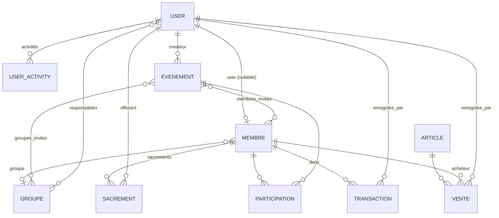

# Modèle de données

Base : **MySQL/MariaDB** par défaut, **PostgreSQL** via `DATABASE_URL`
(c'est le cas sur Render). Toutes les clés primaires sont des **UUID**
(architecture offline-first, voir [architecture.md](architecture.md)).

## Modèles de base (`core/models.py`)

- **`UUIDPrimaryKeyModel`** (abstrait) — `id = UUIDField(primary_key=True,
default=uuid4)`.
- **`SyncableModel`** (abstrait, hérite du précédent) — ajoute `created_at`,
  `updated_at`, `is_deleted` (suppression logique) pour la synchronisation
  hors ligne. Tous les modèles métier en héritent.

## Diagramme entité-relation (simplifié)

## `accounts`

### `User` (identité de connexion)

`AbstractBaseUser` + `PermissionsMixin`, `USERNAME_FIELD = "email"`,
`id = UUIDField` défini directement.

| Champ                 | Type                | Notes                                                                               |
| --------------------- | ------------------- | ----------------------------------------------------------------------------------- |
| `email`               | EmailField unique   | identifiant de connexion                                                            |
| `prenom`, `nom`       | CharField           | synchronisés avec `Membre` (signaux)                                                |
| `role`                | CharField (choices) | `fidele` (défaut) < `responsable` < `secretaire` < `tresorier` < `pretre` < `admin` |
| `phone_number`        | CharField           |                                                                                     |
| `profile_picture`     | ImageField          |                                                                                     |
| `is_verified` / états | BooleanField        | vérification d'e-mail obligatoire avant connexion                                   |

### `UserActivity`

Journal d'activités (`UUIDPrimaryKeyModel`) : utilisateur, action, horodatage —
indexé pour la consultation admin.

## `membres`

### `Membre` (fiche pastorale)

| Champ                         | Type                            | Notes                                                               |
| ----------------------------- | ------------------------------- | ------------------------------------------------------------------- |
| `user`                        | OneToOne → `User`, **nullable** | une fiche peut exister sans compte                                  |
| `nom`, `prenom`               | CharField                       | synchro bidirectionnelle avec `User` (signaux avec garde d'égalité) |
| `date_naissance`              | DateField                       | indexé                                                              |
| `sexe`                        | CharField(1), choices           |                                                                     |
| `quartier`                    | CharField                       |                                                                     |
| `est_baptise`, `est_confirme` | BooleanField                    |                                                                     |
| `groupe`                      | FK → `Groupe` (SET_NULL)        |                                                                     |

L'e-mail, le téléphone et la photo ne sont **pas** stockés sur `Membre` :
dérivés du `User` lié dans le serializer.

### `Sacrement`

| Champ          | Type                                                 |
| -------------- | ---------------------------------------------------- |
| `type`         | CharField choices (baptême, confirmation…) — indexé  |
| `membre`       | FK → `Membre` (CASCADE, `related_name="sacrements"`) |
| `date`         | DateField — indexé                                   |
| `officiant`    | FK → `User` (SET_NULL)                               |
| `observations` | TextField                                            |

## `groupes` — `Groupe`

| Champ           | Type                                           |
| --------------- | ---------------------------------------------- |
| `nom`           | CharField — indexé                             |
| `description`   | TextField                                      |
| `responsable`   | FK → `User` (SET_NULL) — responsable principal |
| `responsables`  | M2M → `User` — co-responsables                 |
| `date_creation` | DateTimeField auto                             |

## `evenements`

### `Evenement`

| Champ                             | Type                       |
| --------------------------------- | -------------------------- |
| `titre`, `description`, `lieu`    | CharField / TextField      |
| `type`                            | CharField choices — indexé |
| `date_debut` (indexé), `date_fin` | DateTimeField              |
| `est_inscription_requise`         | BooleanField               |
| `createur`                        | FK → `User` (SET_NULL)     |
| `invite_tous`                     | BooleanField               |
| `roles_invites`                   | JSONField (liste de rôles) |
| `groupes_invites`                 | M2M → `Groupe`             |
| `membres_invites`                 | M2M → `Membre`             |

### `Participation`

`evenement` (FK CASCADE) + `membre` (FK CASCADE) + `date_inscription`
(unicité couple événement/membre).

## `finances` — `Transaction`

| Champ            | Type                                                     |
| ---------------- | -------------------------------------------------------- |
| `type`           | CharField choices (entrée / sortie) — indexé avec `date` |
| `categorie`      | CharField choices (don, quête, dépense…) — indexé        |
| `montant`        | DecimalField(12, 2)                                      |
| `date`           | DateField — indexé                                       |
| `membre`         | FK → `Membre` (SET_NULL) — donateur éventuel             |
| `enregistre_par` | FK → `User` (SET_NULL)                                   |

## `librairie`

### `Article`

`nom`, `description`, `categorie` (choices), `prix_unitaire` Decimal(10,2),
`stock_disponible`, `seuil_alerte` (alerte de stock), `date_ajout`.

### `Vente`

`article` (FK **PROTECT** — pas de suppression d'article vendu), `quantite`,
`prix_total` Decimal(12,2), `date`, `membre` (SET_NULL), `enregistre_par`
(FK → `User`, SET_NULL).

## Migrations

- Chaque app possède ses migrations committées (`0001_initial.py` généré avec
  le passage aux UUID).
- Tout changement de modèle → `makemigrations <app>` + commit **séparé**.
- La CI vérifie `makemigrations --check --dry-run`.

## Suppression

Les modèles synchronisables utilisent la **suppression logique**
(`is_deleted=True`) afin que les clients hors ligne puissent propager les
suppressions via `/api/v1/sync/`.
